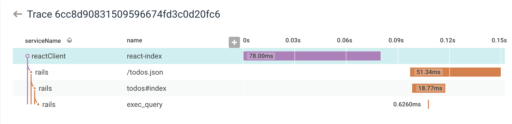

# honeycomb-react-rails-fullstack-tracing

Example of full-stack [tracing](https://www.honeycomb.io/blog/2018/06/get-deeper-insights-with-honeycomb-tracing/)
of an app with a React frontend client and Rails backend, using https://www.honeycomb.io.

It is a simple TODO list app with a single form and model.

The home (index) page has a React Single Page App embedded to create TODOs, which will emit
full-stack client tracing events when the page is loaded (React actions other than
index do not yet have tracing implemented.)

Below is a screenshot example of a full-stack trace in the Honeycomb UI.

Calculating the proper client timestamp offset in the context of server latency
is tricky, as you can see by the misalignment of the client parent span.  I'm
sure my attempt can be improved, issues or PR's welcome!

